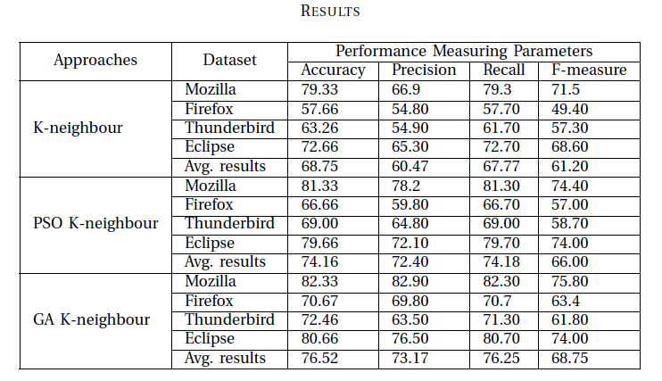

# Bug Hierarchy Optimization Using Meta-Heuristic Algorithms

## Overview

Assigning accurate priorities to bugs manually is a time-consuming and difficult task. Current methods of prioritizing bugs typically use a single feature, which can lead to data loss because bugs have many dependent features. In this project, we propose an efficient way of selecting bug features for prioritizing bugs more accurately using Particle Swarm Optimization (PSO) and Genetic Algorithm (GA). 

Firstly, we apply natural language processing (NLP) techniques to preprocess textual information of bug reports and convert the textual features to numeric features using Term Frequency-Inverse Document Frequency (TF-IDF). During this conversion, many new features are generated, which increases the complexity and running time of algorithms. To minimize this further, we use PSO and GA to select the most related and useful feature set.

Our proposed model combines feature reduction and classification algorithms. We used datasets from Eclipse, Mozilla, Thunderbird, and Firefox for experiments. Results reveal better performance of the model, both with all features and with reduced features, in terms of precision, recall, F-score, and accuracy. We achieved maximum improvement with reduced features (using PSO and GA). The results indicate that the GA-KNN method performs better than the PSO-KNN method in terms of average accuracy.

## Features

- **Genetic Algorithms (GA):** Utilizes evolutionary techniques to optimize bug prioritization and hierarchy.
- **Particle Swarm Optimization (PSO):** Applies swarm intelligence principles to enhance bug management strategies.
- **Scalable Solution:** Designed to handle large datasets and complex bug hierarchies.
- **Visualization:** Provides visual insights into the optimization process and results.

## Drawbacks of Current Methodologies

- **Manual Effort:** Significant time and resources are required for manual prioritization.
- **High Complexity:** Traditional KNN algorithms have high computational complexity.
- **Limited Features:** Some models use limited features, leading to information loss.
- **False Positives:** Bug-finding tools often yield high false-positive rates.
- **Overfitting:** Models without feature reduction techniques may overfit and struggle to scale.

## Advantages of GA and PSO

- **Efficient Search:** GA and PSO efficiently search large, complex spaces for optimal solutions.
- **Adaptability:** These algorithms handle nonlinear, multi-dimensional problems effectively.
- **Improved Performance:** GA and PSO optimize parameters and feature sets better than traditional methods, enhancing accuracy and reducing manual effort.

## About PSO and GA

- **PSO:** Particle Swarm Optimization (PSO) is a computational optimization algorithm inspired by the social behavior of birds and fish. It is a meta-heuristic, population-based optimization approach that heuristically solves a problem by recurring search of a population of candidate solutions. Each particle represents a candidate solution and moves through the search space, with its movement directed by its own experience and the experience of its neighbors. The new position and velocity of particles are calculated based on their current position, velocity, and the best solutions from themselves and their neighbors.

- **GA:** Genetic Algorithm (GA), is a meta-heuristic optimization algorithm, that is based on the process of natural selection and genetics. For this to work, GA relies on the "population of candidate solutions", iteratively updating them by a way of traditional selection,
crossover, and mutation operators. The selection operator selects the best solutions from the current population to be parents of the next generation and crossover operator blends genetic information of two parents to create new offspring. The mutation operator generates
genetic differences in the offspring through the random modification of their genetic makeup to promote diversification in the population.

## Results

Python programming was utilized for the improvement and execution of the bug prioritization strategy. The system was assessed on four bug report datasets (Thunderbird, Firefox, Eclipse, and Mozilla) to evaluate their viability. The severity of bugs was determined using various parameters including precision, recall, accuracy, and F-measure. A study was conducted to evaluate the impact and severity of the bugs, allowing programmers to prioritize bugs for fixing according to their severity.

The study revealed that the GA-KNN method performs better than the PSO-KNN method in terms of average accuracy. On the other hand, PSO-KNN provided more accurate bug severity predictions than KNN techniques. The proposed PSO-based and GA-KNN feature selection method significantly improves the results of KNN computations.

## Conclusion

Our bug prioritization system for bug triage, employing meta-heuristic feature selection algorithms, aims to optimize the quality of software development projects and improve organizational efficiency. This system automates the bug triage process, saving time and effort needed for bug resolution.

The approach utilizes techniques like NLP-based data preprocessing, feature extraction, and feature selection using PSO and GA algorithms to create a feature set that is less dimensional but informative and relevant. It then classifies bug reports into different categories based on their features and attributes using machine learning algorithms.

Overall, the bug prioritization model with meta-heuristic feature selection algorithms is a powerful tool that can enhance the efficiency and quality of software development ventures. With further improvement and refinement, this system can be vital for companies aiming to accelerate their software development and deliver quality products to their customers. Additionally, Genetic Algorithm and Particle Swarm Optimization have shown to work better than SVM, Decision Tree, and Random Forest in terms of operational efficiency.
